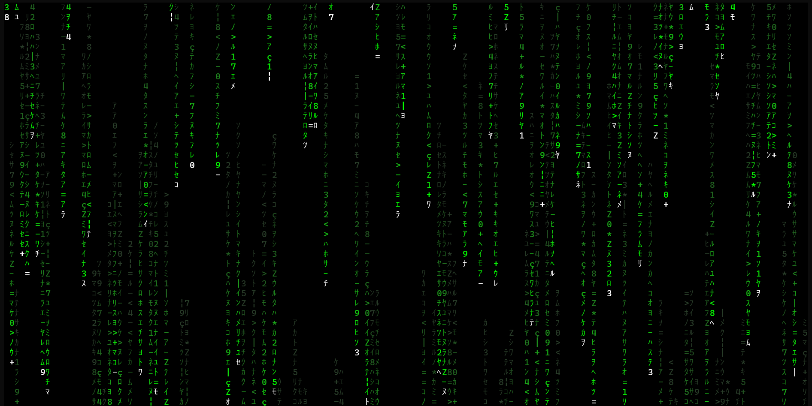
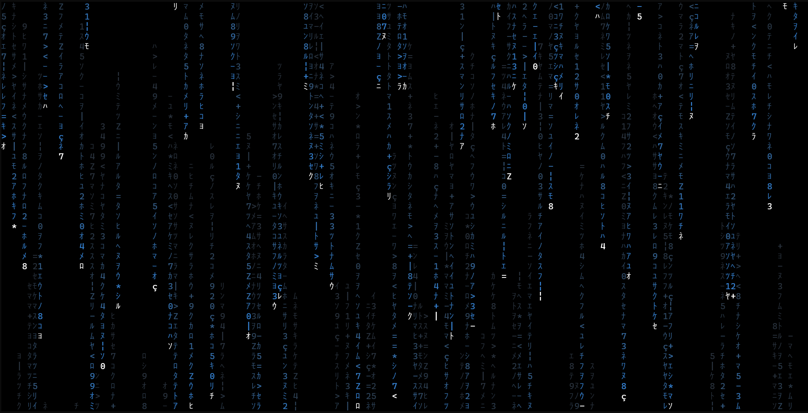
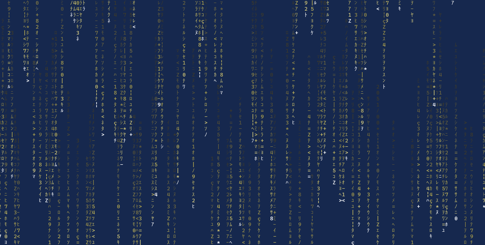

# Matrix Rainfall

## Description

---

This is a simple program that simulates the famous Matrix Rainfall effect. It is written in `Rust` and uses the `crossterm` library for terminal manipulation.

## Usage

---

To run the program, simply clone the repository and run the following command:

```bash

cargo run
```

## Example



